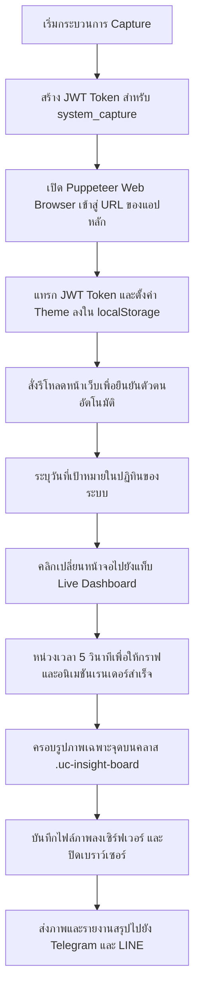

# Dashboard Capture Helper Skill

คู่มือแนวทางการตั้งค่า จัดการ และแก้ไขปัญหาเกี่ยวกับระบบบันทึกภาพหน้าจอ Live Dashboard ด้วย Puppeteer และระบบส่งรายงานแจ้งเตือนผ่านช่องทาง Telegram และ LINE

---

## 📸 ภาพรวมระบบและกลไกการทำงาน (System Overview)

ในเวอร์ชันปัจจุบัน ระบบเลิกใช้งาน Grafana เป็นหลักในการดึงสถิติภาพหน้าจอ และเปลี่ยนมาแคปเจอร์ผ่านตัวหน้าเว็บแอปพลิเคชันหลัก (**NHSO Tracker**) โดยตรงผ่านการจำลองการทำงานบน Puppeteer ในไฟล์ [capture-grafana.js](file:///d:/website/NAE_Manages01/jobs/capture-grafana.js) โดยมีขั้นตอนทำงานแบบ Asynchronous ดังนี้:



---

## ⚙️ การตั้งค่าในไฟล์สิ่งแวดล้อม (`.env` Configuration)

ในการสั่งการบราวเซอร์จำลองและการจัดส่งแจ้งเตือน จะอิงตามตัวแปรหลัก ๆ ในไฟล์ [.env](file:///d:/website/NAE_Manages01/.env) ดังต่อไปนี้:

* **`LOCAL_DASHBOARD_URL`**: ชี้ไปยัง URL ของหน้าเว็บแอปพลิเคชันหลักที่กำลังรันอยู่ (เช่น `http://192.168.80.88:5174/` ในโหมดพัฒนา หรือพอร์ตโปรดักชัน `http://localhost:3005/`)
* **`JWT_SECRET`**: คีย์ลับสำหรับการเข้ารหัสใช้ลงนามสร้าง JWT Token จำลองสำหรับบอทบราวเซอร์
* **`TELEGRAM_BOT_TOKEN`** & **`TELEGRAM_CHAT_ID`**: สำหรับใช้งานในการส่งภาพและสรุปรายงานกลับไปยัง Telegram
* **`LINE_CHANNEL_ACCESS_TOKEN`** & **`LINE_GROUP_ID`**: สำหรับการจัดส่งข้อมูล Flex Message และรูปภาพไปยัง LINE Notify/Messaging API

---

## 🔑 เทคนิคการข้ามระบบความปลอดภัย (JWT LocalStorage Injection)

เพื่อลดข้อผิดพลาดในขั้นตอนพิมพ์รหัสผ่านผ่านแบบฟอร์มหน้าเว็บและการโหลดหน้าระบบที่ล่าช้า Puppeteer จะข้ามกระบวนการกรอกหน้าล็อกอินแบบเดิมโดยใช้วิธี **Inject Credentials** เข้าไปที่ระบบเบราว์เซอร์โดยตรง:

```javascript
// 1. ลงนามสร้าง Token บน NodeJS
const token = jwt.sign({
    username: 'system_capture',
    full_name: 'System Capture Bot',
    role: 'admin',
    department: 'IT'
}, jwtSecret, { expiresIn: '15m' });

// 2. นำไปตั้งค่าที่ localStorage และบังคับ Light Mode ผ่าน Evaluate
await page.evaluate((tok, usr) => {
    localStorage.setItem('nhso_token', tok);
    localStorage.setItem('nhso_user', JSON.stringify(usr));
    localStorage.setItem('theme', 'light');
    document.documentElement.classList.remove('dark');
}, token, tokenPayload);
```

---

## 🎯 การถ่ายภาพครอบตัดเฉพาะจุด (Element screenshot)

เพื่อให้ภาพมีความเป็นทางการ สวยงาม และตรงตามสถิติตัวเลขที่ต้องการเปรียบเทียบ โดยไม่ติดขอบหน้าต่าง เมนูข้าง หรือ Navbar ระบบจะเลือกบันทึกเฉพาะส่วนของบล็อก Smart Group Insights:

```javascript
// รอองค์ประกอบหน้า Live Dashboard เรนเดอร์ขึ้นมาสมบูรณ์
await page.waitForSelector('#live-dashboard-view-container', { timeout: 10000 });
await new Promise(resolve => setTimeout(resolve, 5000)); // รอ Animation Chart

// ค้นหาคลาสการ์ดสถิติ .uc-insight-board
const element = await page.$('.uc-insight-board');
if (element) {
    await element.screenshot({ path: filepath });
} else {
    await page.screenshot({ path: filepath }); // สำรองในกรณีหา selector ไม่เจอ
}
```

---

## 🛠️ วิธีการรันสคริปต์ทดสอบและการแก้ไขปัญหา (Testing & Troubleshooting)

### 1. การรันสคริปต์ทดสอบ (Manual Test)
สามารถทดสอบการรันผ่านคอนโซลได้โดยรันสคริปต์ทดสอบแบบแมนนวล:
```bash
node test-capture.js
```

### 2. แนวทางแก้ปัญหาทั่วไป (Common Issues)
* **รูปภาพออกมามืด (Dark Mode):**
  * เกิดขึ้นเพราะ Tailwind ตรวจพบคอนฟิกธีมตามระบบของ OS (เช่น ตัวเครื่องเซิร์ฟเวอร์ตั้งค่าเป็น Dark Mode)
  * *วิธีแก้:* ตรวจสอบว่าในไฟล์ `capture-grafana.js` มีการเพิ่ม `await page.emulateMediaFeatures([{ name: 'prefers-color-scheme', value: 'light' }]);` และโค้ด `document.documentElement.classList.remove('dark');` แล้วหรือไม่
* **ภาพข้อมูลไม่ขึ้น / กราฟเบลอ:**
  * เกิดขึ้นเพราะหน้าบราวน์เซอร์ประมวลผลอนิเมชันของกราฟิก (เช่น amCharts หรือ Charts.js) ยังไม่เสร็จสิ้นดีขณะบันทึกภาพ
  * *วิธีแก้:* ปรับตัวเลขหน่วงเวลาในคำสั่ง `new Promise(resolve => setTimeout(resolve, 5000))` ให้เหมาะสม (แนะนำขั้นต่ำ 3-5 วินาที)
* **เกิด Error หรือ timeout จากบราวน์เซอร์:**
  * เช็คให้แน่ใจว่าได้ระบุ `LOCAL_DASHBOARD_URL` ใน `.env` ชี้ไปยังตัวแอปที่กำลังเปิดรันและทำงานอยู่จริง
